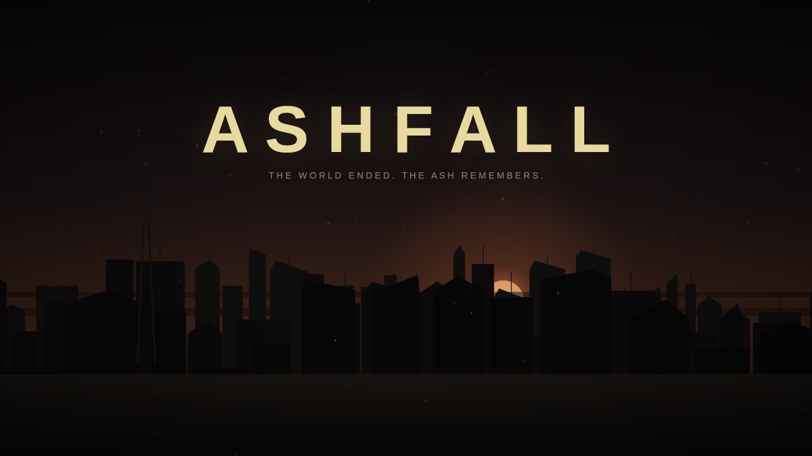
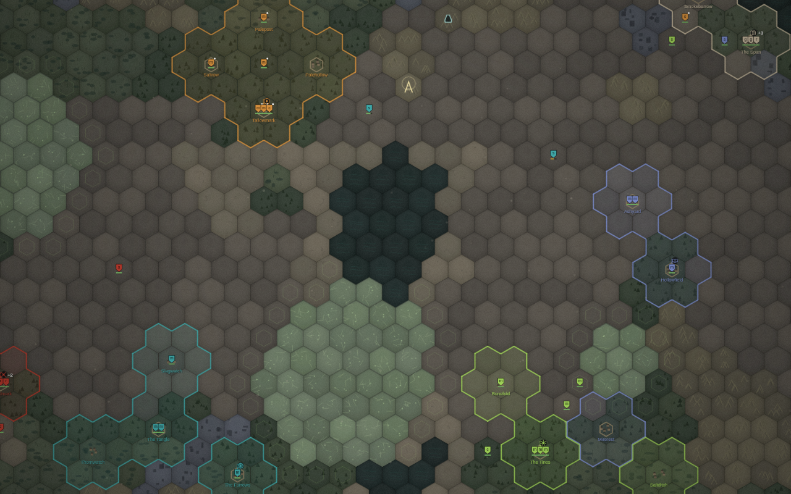
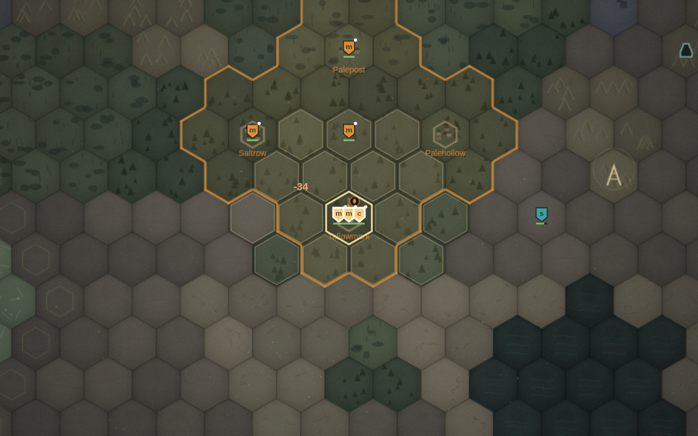

# ASHFALL

**The world ended. The ash remembers.**



An evocative, gritty, **post-apocalyptic grand strategy game** that runs in your
browser. Eighty-seven years after the Fall, six factions scrabble over a
procedurally ruined earth. You lead one of them: feed your people through the
Long Dark, raise warbands from your own thin population, salvage the old
world's bones, weather the ash storms, out-scheme five rival banners — and end
the long silence, by dominion, by survival, or by kindling the Beacon and
making the sky answer.

**Everything is procedural. There are no asset files.** The map is generated
from a seed. The art is drawn live on a canvas. The full layered soundtrack —
drones, wind, war-drums, far-off bells — is synthesized note by note in
WebAudio while you play. The repository contains code and prose, nothing else.

| | |
|---|---|
|  |  |

---

## Install & run

### What you need

- **A modern desktop browser** — Chrome, Edge, Firefox, or Safari from the
  last few years. That's the whole runtime: the game is plain HTML, CSS, and
  JavaScript with no build step, no bundler, and no dependencies.
- **Optionally, Node.js 16+** (or Python 3) — only if you want to serve the
  game over `http://localhost` instead of opening the file directly, or run
  the test suite. The game itself never needs Node.

### 1. Get the code

```bash
git clone https://github.com/TemporariestUsername/Postapocalyptic-Grand-Strategy-Game.git
cd Postapocalyptic-Grand-Strategy-Game
```

No git? Use GitHub's **Code → Download ZIP**, unzip it anywhere, and open
the folder. There is nothing to install afterwards — no `npm install`, no
asset downloads. What's in the folder is the entire game.

### 2. Start the game

**Option A — just open it.** Double-click `index.html`, or from a terminal:

```bash
open index.html        # macOS
xdg-open index.html    # Linux
start index.html       # Windows (cmd)
```

The game runs fine from a `file://` URL because every script is a classic
`<script>` tag and nothing is fetched at runtime.

**Option B — serve it (recommended for keeping saves).** Browsers treat each
`file://` page's localStorage more disposably than a real origin's, so if you
care about your autosaves surviving, serve the folder and play at
`http://localhost:8080`:

```bash
node tools/serve.js          # zero-dependency server bundled with the game
# or, equivalently:
python3 -m http.server 8080
npx serve .
```

Then browse to **http://localhost:8080**.

**Option C — host it anywhere static.** The folder works as-is on GitHub
Pages, Netlify, or any static host — it's just files.

### 3. Play

Click **NEW GAME**, pick a banner, pick how cruel the wasteland should be,
optionally type a seed (any number or phrase — the same seed always builds
the same world), and click **INTO THE ASH**. A short *How to Survive* primer
opens on your first run, and the `?` button brings it back any time. Your
game autosaves every season; **CONTINUE** on the title screen picks it up.

**Turn your sound on.** Browsers block audio until you interact with a page,
so the soundtrack fades in after your first click. If you hear nothing,
check the in-game ⚙ settings sliders and the tab's mute flag — there is no
audio hardware requirement beyond a working speaker.

### Troubleshooting

- **Blank page when double-clicking `index.html`** — some locked-down
  browsers refuse all `file://` scripts. Use Option B instead.
- **"CONTINUE" is greyed out** — there's no save under this origin yet
  (saves from `file://` and `http://localhost` are separate worlds).
- **No music** — click anywhere once (autoplay policy), then check ⚙ →
  Music volume and the **M** mute toggle.
- **It's slow** — zoom out less aggressively, or toggle off film grain in ⚙.
  The renderer is plain Canvas 2D and comfortable on anything from the last
  decade.

(Developers: the test suite and tooling are covered in [Tests](#tests) below.)

---

## The six banners

Each faction plays by its own rules, not just its own numbers:

| Faction | What only they can do |
|---|---|
| **The Hearthbound** | Farmers with rifles, playing tall. Only they raise **Great Granaries** — famine cannot kill in that settlement. Seven structure slots instead of six, faster growth, +25% food. |
| **The Rust Legion** | War as an economy. **Spoils of War** pays +6 scrap per battle won; war never wearies their hope; and their barracks roll out **War-Rigs**, siege engines no one else can field. One rides with them from turn one. |
| **The Veiled Choir** | The Glow does not touch them: they **settle the glasslands from turn one** and harvest knowledge (and even food) from ground that kills everyone else. **Sermons** turn bread into spine — 3 food for +8 hope. Hope never falls below 15. |
| **The Free Caravans** | Everything they field moves **+1 hex**; every faction at peace with them pays **road-toll** (+0.7 scrap each, per season); the market always gives them the friendly price. Peace literally pays. |
| **The Archivists** | They begin already knowing **Signal Discipline**, every Remembrance costs **20% less**, and they bank +50% knowledge. The tech rush, with walls of conviction. |
| **The Court of Teeth** | Their wounds **close anywhere**, owned ground or not; **Carrion** feeds them +4 food per battle won; and they run **Glowhound** packs — fast, cheap, paid in meat instead of scrap. A war-machine that eats its way forward. |

All six are playable; the other five are run by personality-driven AI
(builder, warlord, zealot, trader, hermit, raider) that expands, builds,
researches, raids, declares wars it thinks it can win, sues for peace when it
turns out it couldn't — and uses its own signature tricks against you.

## How a season goes

One turn is one season — Thaw, Glare, Rust, and the **Long Dark**, when food
yields halve and the storms hunt. Each season you:

- **Feed everyone.** Population is your deepest resource: it eats, it grows,
  it staffs every warband you muster. Watch the FOOD net number like it owes
  you money.
- **Build** hydrofarms, scrapforges, stills, clinics, archives, walls,
  barracks, radio masts, purifiers — six structures per settlement, each a
  trade-off.
- **March.** Scavengers salvage vaults and ruins; raiders pillage; militia
  hold; reclaimer crews — three families and a disassembled windmill —
  **found new settlements**, which is how you actually win.
- **Claim** hexes, **trade** at the market, **research** the Remembrance tree
  (Survival / Industry / Signal), manage **Hope** — the resource that, when it
  runs out, your story does.
- **Endure the world's turn.** Rivals act, ash storms walk, the glasslands
  burn whoever stands in them, and the narrative deck deals you another hard
  choice in two or three paragraphs of prose: black rain, deserters, the
  drowned bell, a child born unmarked by the Glow.

**Three roads out:** hold 60% of the world's settlements · outlive every
rival · or research the Long Antenna, claim the Beacon hex, pay its cost, and
keep a warband on the spire for six straight seasons while everyone watches
you do it.

**Controls:** click to select · click a lit hex to march, a red-ringed hex to
attack · drag/arrows pan · wheel zoom · **Enter** ends the season · **Space**
jumps home · **Esc** deselects · **M** mutes. The `?` button has the rest.

---

## The soundtrack

There is no audio directory. `js/audio.js` builds the entire score at
runtime in A phrygian:

- **Drone** — detuned saws and a sub sine breathing through a slow filter LFO;
- **Wind** — looping brown noise through a wandering bandpass;
- **Pads** — chord progressions chosen per *mood*, swelling over two bars;
- **Melody** — sparse chord-aware plucks through a long feedback echo, with
  rare far-off FM bells;
- **Percussion** — toms and metal clanks that only wake when the mood does.

The **mood engine** (calm / tension / war / doom / title) follows the game
state — your wars, your hope, storms on the horizon — and crossfades the
layers over seconds, so peace sounds like grief on hold and war sounds like a
forge falling downstairs. Stingers punctuate events, battles, declarations,
victory, defeat. Every interface click, march, salvage rattle, and hammer
blow is an envelope over oscillators and filtered noise.

## The graphics

There is no image directory either. `js/render.js` draws:

- a pointy-top hex world with per-tile procedural texture — pine barrens,
  blasted glasslands that shimmer at night, drowned water, dead seabed,
  ruined city blocks with broken crowns;
- fog of war, faction borders, hand-drawn faction sigils, settlement clusters
  that grow with population;
- walking ash storms, radiation fringes, battle flashes, floating casualty
  numbers, the Beacon's pulse;
- drifting ash particles, a vignette, and film grain over everything
  (toggleable in settings);
- and the animated title vista — dying sun, ruined skyline, one lit window.

---

## Architecture

```
index.html            shell — classic scripts, works from file://
css/style.css         rust, bone, ash
js/
  util.js  rng.js     helpers; deterministic seeded RNG (sim stream + local streams)
  names.js            procedural names: settlements, leaders by culture, warbands
  data.js             ALL game data: terrain, factions, units, buildings,
                      techs, balance knobs, and the narrative event deck
  worldgen.js         seed -> world: noise terrain, craters, dead cities,
                      sites, faction placement
  sim.js              the simulation core: economy, movement, settlements,
                      tech, diplomacy, market, vision, the Beacon
  combat.js           stack battles, garrisons, capture, capitals falling
  events.js           event engine: draw, gate, apply declarative effects
  ai.js               rival faction brains, one personality each
  turn.js             end-of-season pipeline, storms, victory/defeat, save/load
  audio.js            the synthesized soundtrack + SFX (browser only)
  render.js           the canvas renderer (browser only)
  ui.js  main.js      DOM chrome + controller/input/loop (browser only)
tests/
  run_tests.js        32 headless tests of the whole core — node, no deps
  smoke_dom.js        boots the REAL ui in jsdom and plays seasons (optional)
tools/
  serve.js            zero-dep static server
  screenshot.js       renders real PNGs of the game headlessly (optional)
```

**Design rules the code lives by:**

- **State is plain data.** No classes, no methods on game objects. Save =
  `JSON.stringify`, load = parse + rebuild two derived tables. The game
  autosaves to localStorage every season.
- **Determinism is contractual.** Every gameplay roll flows through one RNG
  stream stored *in* the state; worldgen draws from per-subsystem derived
  seeds. Same seed + same choices = byte-identical history (tested). Seeds
  can be numbers or any phrase you like.
- **The core never touches the DOM.** Everything in `js/` up to `turn.js`
  runs in bare Node, which is what makes the test suite and the headless
  screenshot tool possible.

## Tests

```bash
npm test                     # 32 core tests: worldgen determinism, economy,
                             # combat, events, tech, trade, beacon, save/load,
                             # and 60-season full-AI autoplays with invariants

npm i --no-save jsdom && npm run test:dom    # boots the real UI headlessly:
                             # title -> faction select -> build -> recruit ->
                             # research -> 8 seasons -> save -> load

npm i --no-save @napi-rs/canvas && npm run shots   # re-render the README
                             # screenshots through the actual renderer
```

## Design

The full systems reference — generation contract, economy math, combat
formulas, the event deck's rules, AI behaviour, balance knobs — lives in
[`docs/DESIGN.md`](docs/DESIGN.md).

## License

MIT. Take it, fork it, reskin it, set it on fire — the wasteland keeps no
score. Seed numbers that produced strange worlds gratefully accepted.
